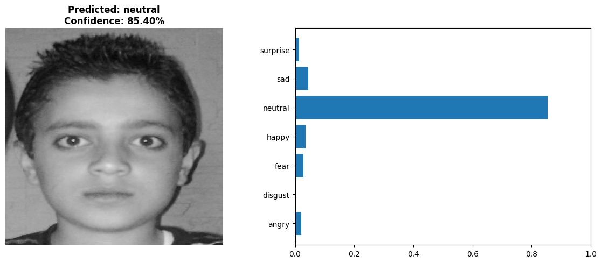
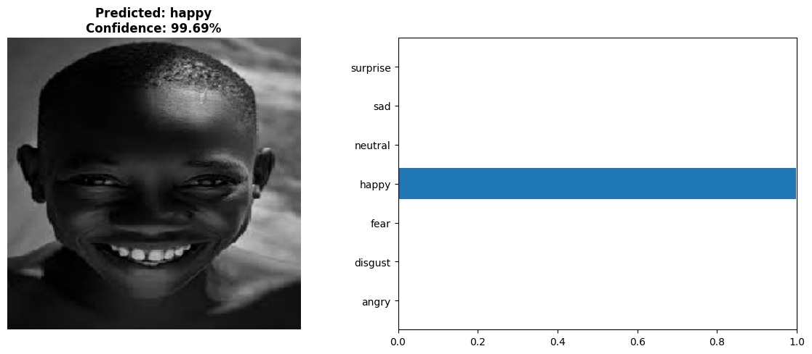
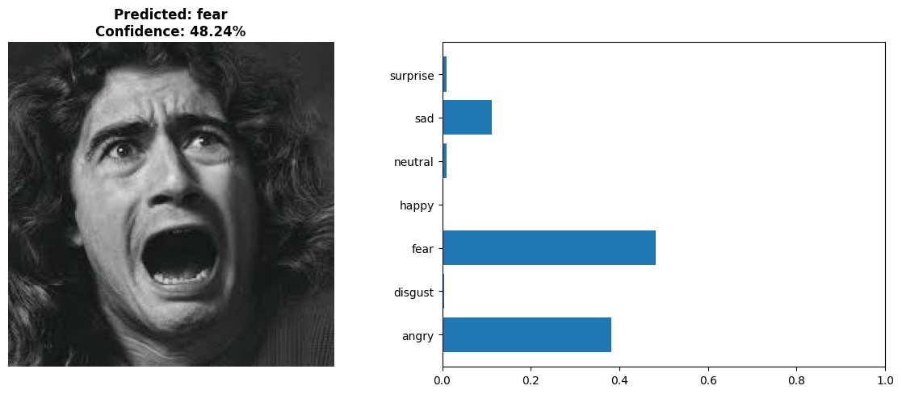

# 🎭 Facial Emotion Recognition using Deep Learning

## 📌 Project Overview

This project implements a **Facial Emotion Recognition (FER)** system using **Deep Learning and Transfer Learning**.
The model classifies human facial expressions into seven emotions using the **FER-2013 dataset**.

The system uses **EfficientNetB0** as a pretrained backbone and fine-tuning techniques to achieve high accuracy while reducing training time.

---

## 🎯 Objectives

* Build an accurate emotion classification model
* Apply transfer learning with EfficientNet
* Handle dataset imbalance using class weights
* Improve generalization using data augmentation
* Evaluate performance using confusion matrix and per-class accuracy

---

## 🧠 Emotions Detected

* Angry
* Disgust
* Fear
* Happy
* Neutral
* Sad
* Surprise

---

## 🏗️ Model Architecture

EfficientNetB0 (ImageNet pretrained)
→ GlobalAveragePooling
→ Dense (512) + BatchNorm + Dropout
→ Dense (256) + BatchNorm + Dropout
→ Softmax (7 classes)

---

## ⚙️ Technologies Used

* Python
* TensorFlow / Keras
* NumPy
* Matplotlib / Seaborn
* Scikit-learn

---

## 📂 Project Structure

```
DeepLearningProject/
│
├── facial_emotion_recognition.ipynb   # training & evaluation notebook
├── README.md
├── .gitignore
├── report.txt
│
├── archive/          # dataset (not uploaded to GitHub)
├── outputs/          # results/models (ignored)
└── ImgTest/          # test images (ignored)
```

---

## 📊 Training Features

* Data augmentation
* Transfer learning
* Fine-tuning last layers
* Class weights for imbalance
* Early stopping
* Learning rate scheduling
* Label smoothing

---

## 📈 Evaluation Metrics

* Accuracy
* Loss
* Confusion Matrix
* Classification Report
* Per-class Accuracy

---

## 🚀 Results

Example results:

* Validation Accuracy: ~ 66.82%
* Test Accuracy: ~ 67.32%











---

## ▶️ How to Run

### 1️⃣ Install dependencies

```
pip install tensorflow numpy matplotlib seaborn scikit-learn
```

### 2️⃣ Prepare dataset

Download FER-2013 dataset and place inside:

```
archive/train
archive/val
archive/test
```

### 3️⃣ Run notebook

Open:

```
facial_emotion_recognition.ipynb
```

and run all cells.

---

## 📥 Download Large Files

Large files are stored externally:

* Dataset: https://www.kaggle.com/datasets/msambare/fer2013
* Trained models and fulled project: https://drive.google.com/drive/u/0/folders/1UzZOI65JOElk4bvhVw7-Knzk_AwsNLpZ


---

## 📚 Academic Context

This project was developed as part of a **Deep Learning course** to demonstrate:

* CNN transfer learning
* Hyperparameter tuning
* Model evaluation
* Practical computer vision application

---

## 👤 Author

Samer Abu Zaina
Computer Engineering 
Deep Learning & Mobile Developer 

---

## ⭐ License

This project is for educational purposes.
